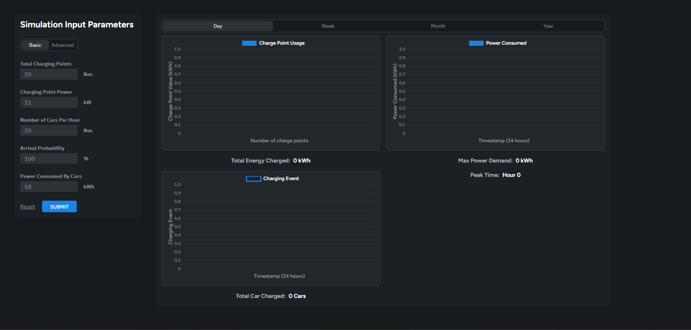
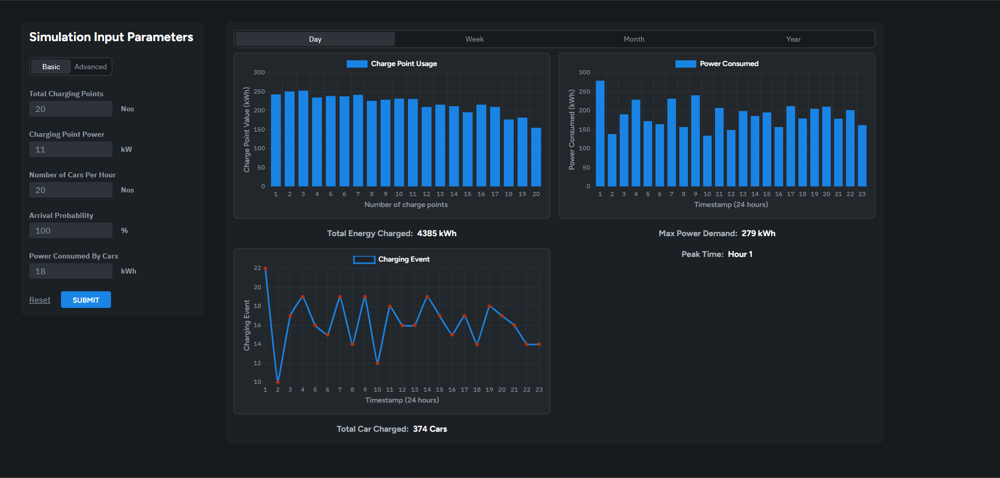
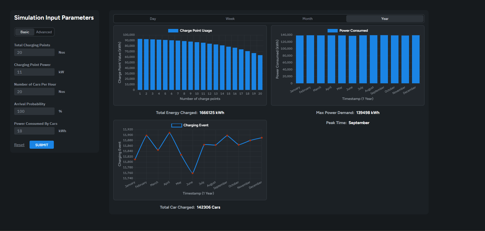
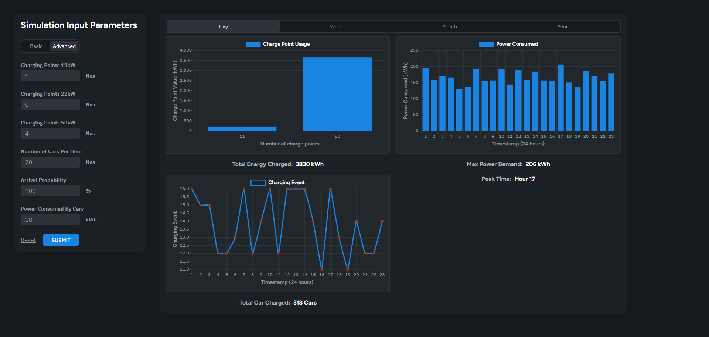
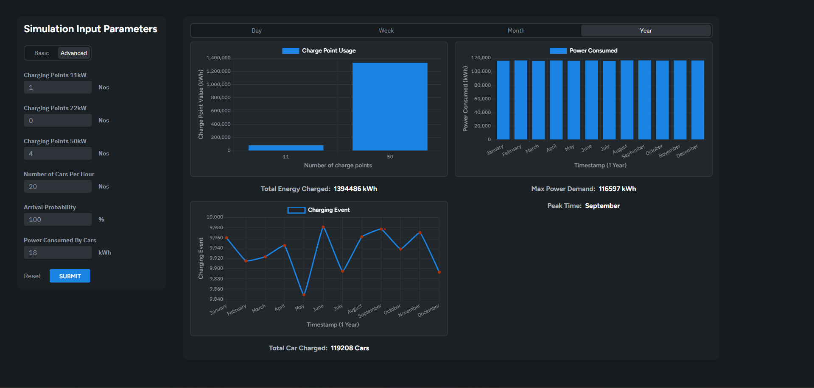
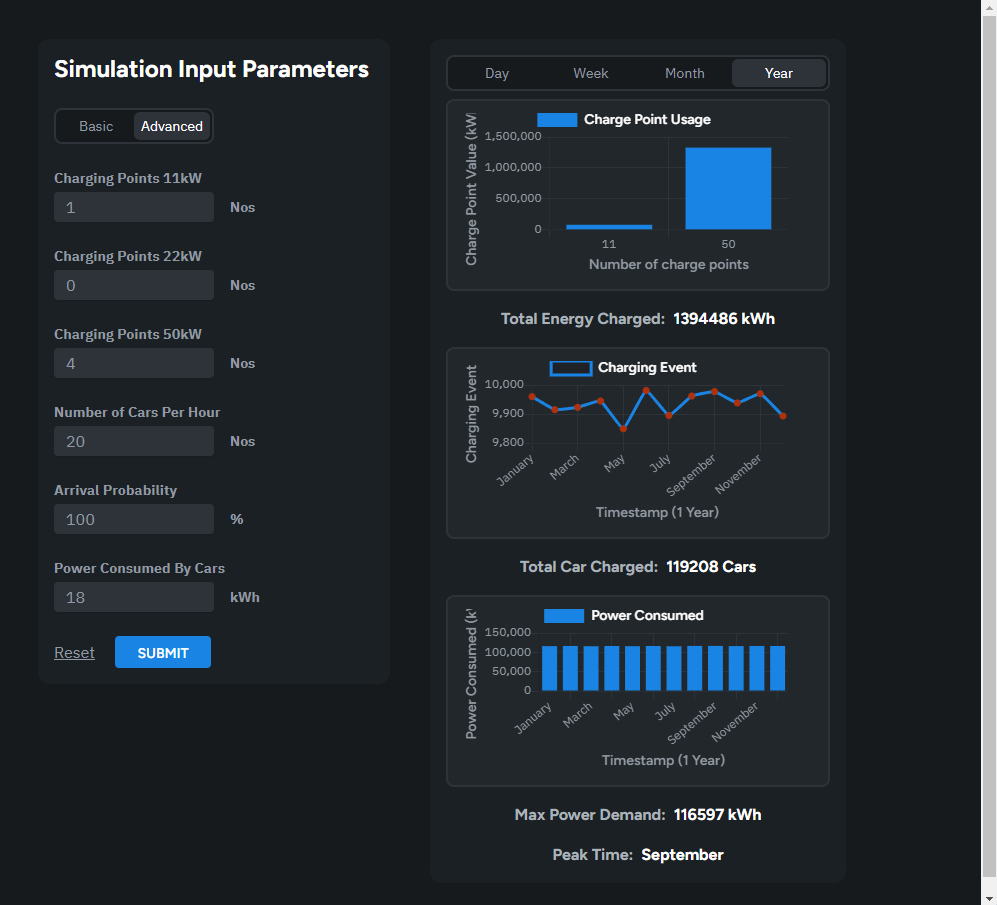
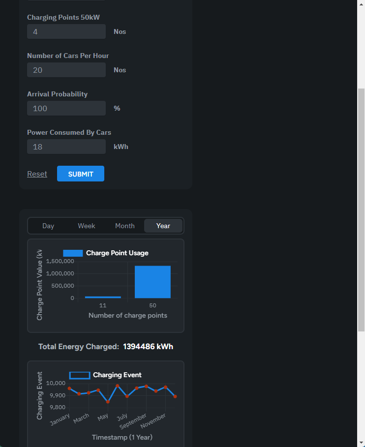

# Reonic Task

## Overview

This is a simple web application.

## How to Run the App

Follow these steps to set up and run the app locally:

### 1. Clone the Repository  
Clone the app to your local repository:
```bash
git clone https://github.com/yourusername/reonic-task.git
```

### 2. Install Dependencies  
After cloning the repository, navigate into the project folder and run the following command to install the required dependencies:
```bash
npm install
```

### 3. Run the Development Server  
Start the app in development mode by running:
```bash
npm run dev
```

Once these steps are complete, the app will be running at **http://localhost:5173/**.

## Images

### 1. Basic no data


### 2. Basic day data


### 3. Basic year data


### 4. Advanced day data


### 5. Advanced year data


### 6. Advanced responsive


### 7. Advanced responsive sm
